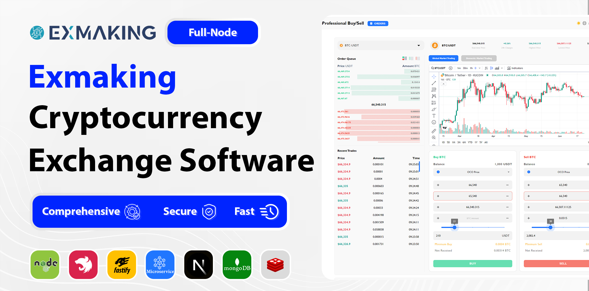

# Exmaking Cryptocurrency Exchange Node.js Script | DEX 

**Exmaking**  
The Best Backend Technology Using Node.js, Microservice Architecture, and Dockerized Version.

Run Your Own Cryptocurrency Exchange with a High-tech, Tested, Secure, and Ready-to-use Script.

## Why Choose A Cryptocurrency Exchange Script ?
Choosing A Crypto Currency Exchange Script Offers Numerous Advantages That Can Significantly Enhance Your Business Operations and User Experience:
- Quick Deployment  
- Cost-Effective  
- Proven Security  
- Feature-Rich  
- Scalability  
- Customizability  

## Features At Glance

Exmaking Provides You with the Latest Features and Services Found in Renowned Cryptocurrency Exchanges Worldwide

- Limit Order  
- Market Order  
- Stop Limit  
- Stop Market  
- OCO Price  
- Futures  
- Leverage  
- Professional P2P Trading
- Instant Trading
- Numerous Tokens Trading

## Core Features
Exmaking Offers A Comprehensive Set of Core Features Designed to Provide A Seamless and Efficient Cryptocurrency Trading Experience.
### Pro UI/UX 
Responsive Design Techniques and Adaptive Layouts to Cater to Various User Contexts.

### Application  
Provide You with the Web View Version in Flutter

### Multiple Payment Methods
Enjoy Using Various Methods for Deposit Including Full Node, Manual, Gateway for Each Symbol

### Multiple Blockchains
3rd Party Integration, Coinpayments Cryptocurrency Payment Gateway, Tatum Web3 Projects, RPC Nodes

### Multilingual
Support Over 8 Different Languages, Switch Languages Quickly and Easily

### Liquidity Management
Make Use of Order Books, Charts, and Liquidity of More Than 30 Exchanges

### Automated Cryptocurrency Withdrawals
This Functionality Enhances User Experience and Operational Efficiency by Automating the Withdrawal Process.

### Referral Code Creator
Generate Unique Referral Code and Share It with Others to Make Money

### Microservice Architecture
This Exchange is Based on 6 Different Services, Granting You More Security And Flexibility.

### Theme Selection 
Easily Switch Between Dark and Light Themes Based on Your Preference or Environment.

### Future Trading
Enjoy Futures Trading on Assets with Dynamic Leverage Specification from the Admin Panel.

## Security Measures
Ensuring the Security of Your Cryptocurrency Exchange Platform Is Paramount. Exmaking Incorporates Advanced Security Measures to Protect User Assets and Data. Key Security Features Include:
- Validation Parameter  
- Rate Limiter  
- Secure Sockets Layer (SSL)  
- CSRF Protection  
- Encrypted Database  
- JWT (JSON Web Tokens)  
- No Sniff  
- Cache Control (Cache Time/Age)  
- Expect-CT (Certificate Transparency)  
- X-powered-by  
- Credentials  
- CORS (Cross-Origin Resource Sharing)  
- Frame Guard  
- HSTS (HTTP Strict Transport Security)  
- Validation Pipe  
- Helmet  

## Main Advantages of Dockerized Service
Dockerizing Your Cryptocurrency Exchange Script Brings Several Key Advantages That Enhance the Deployment, Management, and Scalability of Your Platform. Here Are the Main Benefits:
### Dockerized Technology
With This Cutting-Edge Technology, Enjoy More Adaptability, Security, and Speed in Your Exchange, and Manage Your Platform Easily.

### Simplified Deployment
Docker Simplifies the Deployment Process. With Docker Compose, You Can Define and Run Multi-Container Docker Applications. Deployment Scripts Are Easy to Manage and Reproduce.

### Version Control and Rollbacks
Docker Images Are Versioned, Making It Easy to Track Changes, Roll Back to Previous Versions, and Manage the Lifecycle of Your Applications.

### Scalability and Flexibility
Docker Enables Easy Scaling of Applications. You Can Quickly Launch Multiple Containers Across Various Systems to Balance Load and Handle Traffic Spikes.

### Cost Savings
By Optimizing Resource Usage and Enabling Higher Density of Application Deployments, Docker Can Help Reduce Infrastructure Costs.

### Improved CI/CD Pipelines 
Docker Integrates Well With Continuous Integration and Continuous Deployment (CI/CD) Tools, Enabling Automated Testing, Building, and Deployment of Applications.

### Isolation 
Each Container Operates in Its Isolated Environment, Ensuring That Applications Do Not Interfere With Each Other. This Isolation Enhances Security and Simplifies Dependency Management.

## Frequently Asked Questions
### Will There Be Future Updates for the Script?  
Yes, We are Committed to Continuously Improving and Updating the Exmaking Cryptocurrency Exchange Script. Future Updates will Include New Features, Security Enhancements, Performance Optimizations, and Compliance With the Latest Industry Standards.

### Which Coins and Tokens Are Supported by Exmaking?
You Have the Ability to Add Tokens As Many As You Wish From the Admin Panel. All You Need to Do Is Just Watch the Tutorial and Take the Steps One by One.•	Listing Your Own Token Is Also Available on Most Popular Networks.

### Who Will Handle the Installation of the Software?
We Are Responsible for Installing the Software. Our Team Will Handle the Entire Installation Process, Ensuring That Everything Is Set Up Correctly and Efficiently. If You Encounter Any Issues or Have Questions During the Installation, Please Feel Free to Reach Out to Us for Assistance.
### Will We Receive the Source Code of the Product?
Yes, Buyers Will Receive the Full Source Code of the Product. This Allows for Complete Customization and Flexibility to Meet Your Specific Needs. Our Team Is Available to Assist with Any Questions or Support You May Need Regarding the Source Code.

## Support and Contact Information
For more information and to start using Exmaking Exchange, please download the attached guide file or contact us via Telegram.

[Download the script](bitnal-codecanyon-v2.docx)
